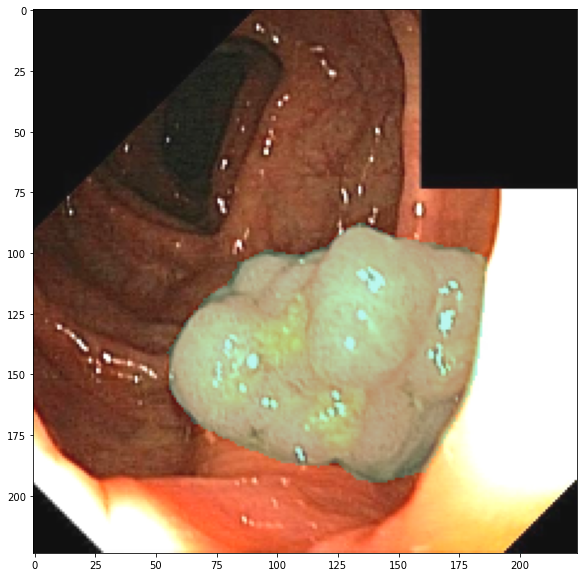
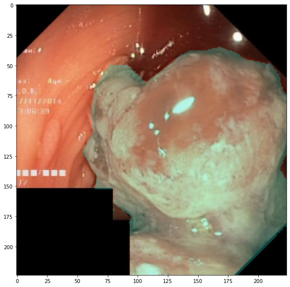
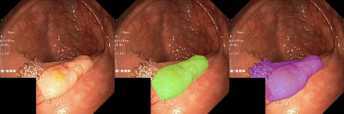
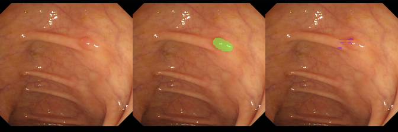

# TedSeg
2d Image Segmentation pipeline. Quick prototyping with different components.

# Sample usage:
Segmentation of polyps from [Kvasir-SEG](https://datasets.simula.no/kvasir-seg/) colonoscopy dataset.

```python
import os
import torch
from TedSeg import *
```


```python
SEED = 114
seed_worker, g = set_seed(SEED, desterministic_algorithm=False)
```

## Hyperparams


```python
from functools import partial

EXP_NAME = 'resnet18'
IMG_SIZE = 224
TRAIN_BS = 128
LR = 1e-2
N_EPOCHS = 200

OPT_FUNC = partial(torch.optim.Adam, lr=LR)
LR_SCHEDULER = 'COSINE_LR'

LOSS = dice_loss
METRIC = batch_dice_score

VALIDATE_EVERY = 20
TRAIN_NW = 8

def get_training_augmentation(img_size):
    train_transform = [
        albu.OneOf([
            albu.RandomBrightnessContrast(brightness_limit=0.2, contrast_limit=0.2, p=0.5),
        ]),
        albu.HorizontalFlip(p=0.5),
        albu.VerticalFlip(p=0.5),
        albu.ShiftScaleRotate(0.05, 0.1, rotate_limit=90, border_mode=cv2.BORDER_CONSTANT, value=0, p=0.6),
        albu.SmallestMaxSize(img_size),
        albu.CenterCrop(img_size, img_size),
    ]
    return albu.Compose(train_transform)
```

## Model


```python
from models.unet import Unet

encoder_args = {
    "pretrained":False,           
}
decoder_args = {
}
MODEL = Unet(encoder_args=encoder_args)
```

## Data


```python
import pandas as pd

train = pd.read_csv('./Kvasir_SEG/train.csv')
valid = pd.read_csv('./Kvasir_SEG/valid.csv')
test = pd.read_csv('./Kvasir_SEG/test.csv')

data_path = './kvasir/'

train['image'] = data_path + 'image' + train['image']
train['mask'] = data_path + 'mask' + train['mask']

valid['image'] = data_path + 'image' + valid['image']
valid['mask'] = data_path + 'mask' + valid['mask']

test['image'] = data_path + 'image' + test['image']
test['mask'] = data_path + 'mask' + test['mask']

train_ds = SegmentationDataset(train, get_training_augmentation, IMG_SIZE)
valid_ds = SegmentationDataset(valid, get_validation_augmentation, IMG_SIZE)
test_ds = SegmentationDataset(test, get_validation_augmentation, IMG_SIZE)
```


```python
train_ds.show_img(), valid_ds.show_img()
```


    


    

    


```python
from torch.utils.data import DataLoader
train_dl = DataLoader(train_ds, batch_size=TRAIN_BS, 
                      shuffle=True, num_workers=TRAIN_NW, pin_memory=True,
                        worker_init_fn=seed_worker,
                        generator=g)
valid_dl = DataLoader(valid_ds, batch_size=16, 
                      num_workers=4, shuffle=False,
                     worker_init_fn=seed_worker,
                        generator=g)
```


```python
learn = Learner(model=MODEL, data=(train_dl, valid_dl), loss=LOSS, 
                name=EXP_NAME, metric=METRIC)
```


```python
import torch
n_epochs = N_EPOCHS
optim = OPT_FUNC(learn.model.parameters())

COSINE_LR = partial(torch.optim.lr_scheduler.CosineAnnealingLR, T_max=len(learn.data[0])*N_EPOCHS)
lr_scheduler = eval(LR_SCHEDULER)(optim)
```


```python
learn.fit(n_epochs, optim, lr_scheduler, 'iteration', VALIDATE_EVERY)
```


    /home/me/.local/lib/python3.8/site-packages/torch/nn/functional.py:718: UserWarning: Named tensors and all their associated APIs are an experimental feature and subject to change. Please do not use them for anything important until they are released as stable. (Triggered internally at  /pytorch/c10/core/TensorImpl.h:1156.)
      return torch.max_pool2d(input, kernel_size, stride, padding, dilation, ceil_mode)


    

    


    Ep.    0|train_loss: 0.6734|valid_loss: 0.7030|valid_metric: 0.268 -saved
    Ep.   20|train_loss: 0.4334|valid_loss: 0.6007|valid_metric: 0.348 -saved
    Ep.   40|train_loss: 0.3616|valid_loss: 0.4286|valid_metric: 0.531 -saved
    Ep.   60|train_loss: 0.2996|valid_loss: 0.4865|valid_metric: 0.467 
    Ep.   80|train_loss: 0.2380|valid_loss: 0.3081|valid_metric: 0.696 -saved
    Ep.  100|train_loss: 0.1871|valid_loss: 0.2671|valid_metric: 0.720 -saved
    Ep.  120|train_loss: 0.1642|valid_loss: 0.2619|valid_metric: 0.728 -saved
    Ep.  140|train_loss: 0.1535|valid_loss: 0.2393|valid_metric: 0.754 -saved
    Ep.  160|train_loss: 0.1278|valid_loss: 0.2457|valid_metric: 0.737 
    Ep.  180|train_loss: 0.1322|valid_loss: 0.2134|valid_metric: 0.766 -saved


## Evaluation

```python
learn.get_dice_score(learn.data[1])
```
    0.7603531
```python
test_loader = DataLoader(SegmentationDataset(test, get_validation_augmentation, IMG_SIZE), 
                         1, num_workers=4,shuffle=False, drop_last=False)
learn.get_dice_score(test_loader)
```


    0.81718695


```python
test_loader = DataLoader(SegmentationDataset(endotect, get_validation_augmentation, IMG_SIZE), 
                         1, num_workers=4,shuffle=False, drop_last=False)
learn.get_dice_score(test_loader)
```
    0.82814026


```python
learn.show_img()
```


    

    

